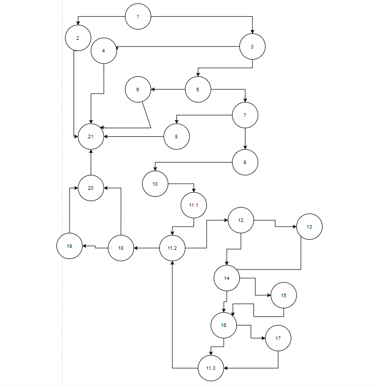

# Втора лабораториска вежба по Софтверско инженерство

## Дамјан Илиевски, бр. на индекс 185025

### Група на код:
Ја добив групата на код 3

### Control Flow Graph

### Цикломатска комплексност
Цикломатската комплексност на овој код е 10, истата ја добив преку број на региони (9 внатерешни + 1 надворешен).

### Тест случаи според критериумот Every branch
Табелата за Every Branch критериумот можете да ја најдете [тука.](EveryBranchTable_185025.xlsx)
За овој критериум ни се потребни сите гранки од Control Flow графот кој е прикажан на сликата погоре.
Во табелата која е наведена во оваа датотека се прикажани сите гранки од графот (приме: 1--2 е гранка од јазол 1 до јазол 2).
Секој јазол претставува еден или повеќе искази од класата **SILab2.java** и истите се означени со коментар во самиот код на класата.
Јазолот 11 е поделен на 3 дела ( for циклус ) така што 11.1 е иницијализација на почетната вредност (бројач), 11.2 е условот од циклусот и 11.3 е инкремент на бројачот.
За да ги препокриеме сите гранки потребно е да се направат тест случаи кои минуваат низ самите гранки.
Во табелата се наведени сите тест случаи и секоја гранка е измината со истите.
### Тест случаи според критериумот Multiple Conditions
Табелата за Multiple Conditions критериумот можете да ја најдете [тука.](MultipleConditionTable_185025.xlsx)
Multiple Conditions критериум функционира така што ги наоѓаме сите if искази каде што има повеќе од еден услов и за истите проверуваме дали ќе го исполни условите или не со тест случаи.
Сите тест случаи се прикажани во табелата која е наведена во овој дел.
### Објаснување на напишаните unit tests
Тестовите се напишани така што во директориум src/test/java креираме тест класа за класата **SILab2.java** и во класта креираме 2 функции со нотација @Test.
Едната функција е за тест случаи од критерумот Every Branch, а другата пак за критериумот Multiple Conditions.
Користени се изразите assertTrue, assertFalse и assertThrows така што доколку функцијата function од класата **SILab2.java** враќа вредност true го користиме изразот assertTrue, доколку пак враќа вредност false го користиме assertFalse.
Доколку пак функцијата фрла исклучок го користиме assertThrows каде што наведуваме кој тип на исклучок ни ќе ни врати функцијата и го сместуваме во објект од истиот тип и сто изтазот assertTrue проверуваме дали е соодветната порака која е испратена од самиот исклучок.
Во класата се иницијализирани 2 објекти и една листа кои се користат во функциите.
Првиот објект е од класата SILab2 кој се користи за повикување на функцијата function, a другиот пак од класата User кој се користи како параматер при повкување на фунцкијата function, вредностите во овој објект се менувани по потреба на тест случајот.
Листат се користи како параметар во функцијата function, но не е искористена во самата функција и затоа е поставена на вредноста null.
Сите тестирања се валидни и проверени дури и искоментирани во самата класа каде што се креирани(во **SILab2Test.java**).
 
